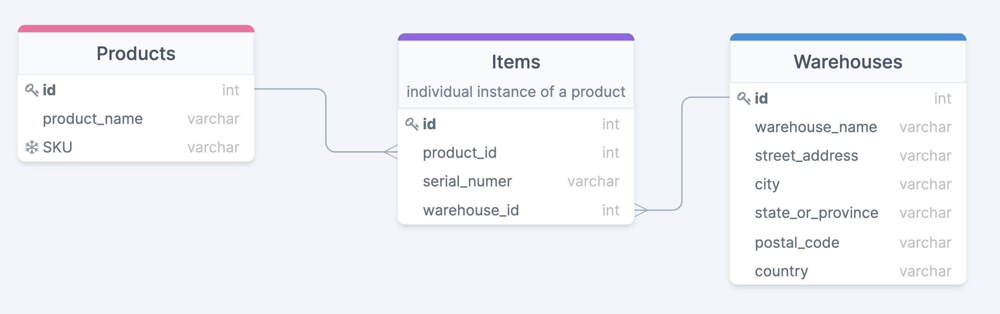
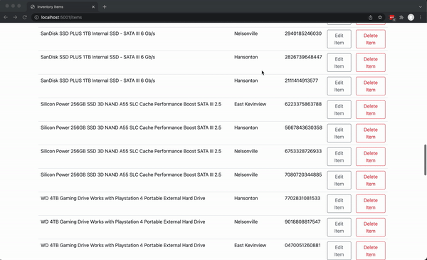
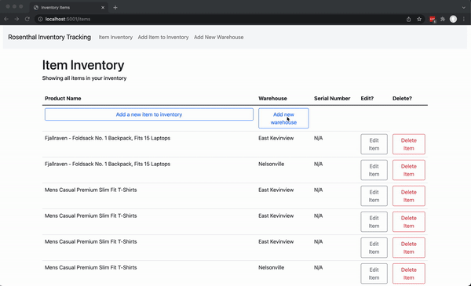
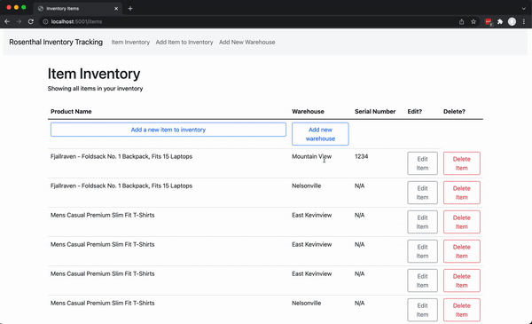

# Inventory Tracking App Overview
This is an inventory tracking web application. The application has the following features:
- Basic CRUD functionality. Using the web app, the following actions can be completed:
    * Create inventory items
    * Edit them
    * Delete them
    * View a list of them
- Ability to create warehouses/locations and assign inventory to specific locations

# Tech Stack
Backend: Python, Flask, PostgreSQL, SQLAlchemy, Jinja

Frontend: JavaScript, HTML/CSS, Bootstrap

# Structure
- `server.py` contains Flask server setup and all routes
- `model.py` set up of PostgreSQL database that stores items, products, and warehouses
- `crud.py` contain functions for interacting with the PostgreSQL database
- `/templates/` contains all HTML Jinja templates
- `/static/js/` contains all JavaScript files, mainly used to send fetch requests to backend.
- `tests.py` contains tests for the application

# Data Model
See below for the data model that is implemented in `model.py`

# App Functionality and Screencasts

On the item inventory page, users can view an overview of all items in inventory

Users can create a new warehouse location, and edit items in inventory to assign to a different warehouse location. Users can also edit other item data, such as item serial number, at the same time.

Users can also delete existing items from inventory, and create new items to add to inventory.

# Running the app

- Set up and activate a python virtual environment. In the command line, run:
    * `virtualenv env`
    * `source env/bin/activate`
- Install all dependencies:
    * `pip3 install -r requirements.txt`
- Set up and seed the database (NOTE: this will drop the `inventory_track_app` PostgreSQL database and create a new one. Do not run this script if you do not want to drop the database)
    * run `python3 recreate_and_seed_db.py`
- Start up the server and run the app!
    * run `python3 server.py`
    * Navigate to `localhost:5001` to see the app in your browser

# Running tests

- Set up a testing database:
    * `createdb inventory_test_db`
- Run the test file
    * `python3 tests.py`

# Next steps

In the future, I would prioritize the following as I worked to improve the app:
- Add additional tests, including unit tests and integration tests, to improve test coverage
- Create different inventory views, such as a view that shows item counts by product or by warehouse
- Improve the UI for adding or editing new items. Currently adding/editing items involves redirection to a different page and then back to the item inventory. It would be nice if users could edit/add items with a modal or other tool on the item inventory page.
- Add more error handling on the backend to display an error on the frontend if a CRUD action could not be completed (for instance, show users an error in the web app if an item was not successfully updated in the database)
- Deploy the site

